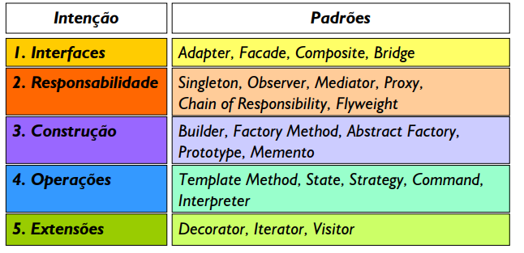
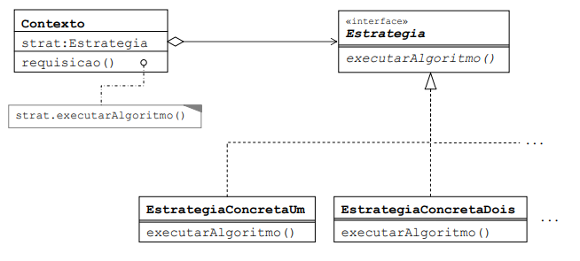

# **DESIGN PATTERNS**
<!--  -->
Intenção | Padrões
---------|----------
Interfaces      | Adpater, Facade, Composite
Responsabilidade      | Singleton, Observer, Mediator, Chain of Responsability
Construção      | Builder, Factory, Abstract Factory
Operações      | Strategy, Command, Interpreter
Extensões | Decorator, Iterator, Visitor

### **Strategy :**
Strategy permite que os algoritmos mudem independentemente entre os clientes que os utilizam.

* Padrão **Comportamental**.
* Quando precisa encapsular algoritmos similares para tomar alguma decisão.

Existem três entidades dentro do Strategy:
1. Estratégia (Interface)
2. Estratégia Concreta (Implementação do contrato da interface)
3. Contexto (Quem utiliza a estratégia)

Quando usar?
* Classes relacionadas forem diferentes **apenas** no **comportamento**.
* Quando uma classe define muitos **comportamentos**, e estes aparecem na forma de **condicional** em suas operações.

### **Factory :**
Factory Method permite que uma classe delegue a responsabilidade de instanciamento às subclasses

* Design Pattern de **Construção**.
* Desacopla o cliente dos tipos de produtos específicos.
*Remove da classe cliente todo conhecimento sobre as subclasses de produtos.
* Estende o programa de forma dinâmica.
* *Consequência negativa* → Aumenta o número de classes do sistema.

### **Abstract Factory :**
* Design Pattern de **Criação**.
* É uma Factory Method, porém composto por **múltiplas Factory Methods**.
* Visa agrupar família de produtos compativeis compativeis, criando assim uma factory divida por grupos.

Algumas consequência são levadas em conta, dentre delas:
* *Positivas* → Os produtos sempre são compatíveis, aplicação do Open-Closed (SOLID), e aplicação do Single Responsibility Principle (SOLID) ou seja, o código que cria está separado do que usa.
* *Negativos* → Muitas classes e maior complexidade.

### **Reflection :**
Vale notar que Reflection **não é considerado um Design Pattern.**
* Manipulador de classes, obter informações de classes, etc…
* Utilizado em tempo de execução do programa.

### **Dep. Injection :**
Podemos dizer que a injeção de dependência é uma inversão de controle, uma vez que não mais seu business realiza a instanciação de classes, mas sim quem está consumindo a classes, passando a responsabilidade de definir qual instância será utilizada para um “agente externo”.

* Uso benéfico de interfaces.
* Menor acoplamento.
* Um objeto implementar várias interfaces, ou seja, várias dependências injetadas.
* Facilita evolução do objeto.

### **Chain Of Responsibility :**
* É usado quando uma requisição precisa passar por uma **sequência de operações** até ser totalmente tratada.
* Desacopla quem envia a requisição de quem vai tratar a requisição.
* Muito utilizado em requisição HTTP.

# **ECOSISTEMA SPRING**
Spring Boot é uma ferramenta que nasceu do framework Spring, baseado em design patterns de inversão de controle e injeção de dependência. 

No geral, ele fornece a maioria dos componentes necessários em aplicações em geral de maneira pré-configurada, possibilitando uma aplicação rodando em produção rapidamente, com o esforço mínimo de configuração e implantação.
Em outras palavras, podemos entender o Spring Boot como um template pré-configurado para desenvolvimento e execução de aplicações baseadas no Spring.

* Oferecer uma experiência de início de projeto rápida e direta.
* Apresentar uma visão opinativa e flexível sobre o modo como os projetos Spring devem ser configurados.
* Fornecer requisitos não funcionais pré-configurados.
* Não prover geração de código e zerar a necessidade de arquivos XML.

Dentre o Spring framework, pode-se dividir em 7 grupos

* Core Container;
* Data Access/Integration;
* Web;
* Aspect Oriented Programming (AOP);
* Instrumentation;
* Messaging;
* Test;

Core Container → Responsáveis por conter funcionalidades fundamentais como classes básicas e avançadas, assim como configurações por anotações ou XML.

Data Access / Integration → Funcionalidades para transação com banco de dados.

Web → Recursos web como implementação de MVC, Web Services, REST.

Módulo AOP → Implementação para programação orientada a aspectos, em resumo, mensageria de microsserviços.

Test → Testes unitários utilizando JUnit, e testes de integração.

### **Beans :** 
Dentro do Spring Framework, faz-se utilização da injeção de dependência, na qual a implementação está presente no Core Container. Quando a aplicação é executada, as configurações pré-definidas em classes ou arquivos XML são lidas e criadas através da inversão de controle, sendo criadas e destruídas durante a execução do projeto. Essas dependências são chamadas de Beans dentro do contexto Spring.

**Bean com a anotação do tipo @Component, @Service, @Controller**

Bean do tipo Component :
~~~~Java
@Component
public class Produto{
    private String nome;
    private BigDecimal valor;
    //... Getters e Setters
}
~~~~

Bean do tipo Service :
~~~~Java
@Service
public class ProdutoService{
    //... Regras de negócios
}
~~~~

Bean do tipo Controller :
~~~~Java
@Controller
public class ProdutoContollers{
    //... POST, GET, PUT, DELETE
}
~~~~

Bean do tipo Repository :
~~~~Java
@Repository
public class ProdutoRepository{
    //... Transações de banco de dados
}
~~~~

É necessário entender aoned que o Spring ira injetar as instânciaas de depedências, por isso é necessário criar pontos de injeção, que é uma maneira de entregar as dependências ao objeto o que necessitar.

Injeção de Dependências através de **Construtor** :
~~~~Java
@Service
public class ProdutoService{
    private ProdutoRepository produtoRepository;

    public ProdutoService(ProdutoRepository produtoRepository){
        this.produtoRepository = produtoRepository;
    }

    //... Regras de negócios
}
~~~~

Injeção de Dependências através de **Setter** :
~~~~Java
@Service
public class ProdutoService{
    private ProdutoRepository produtoRepository;

    public void setProdutoRepository(ProdutoRepository produtoRepository){
        this.produtoRepository = produtoRepository;
    }

    //... Regras de negócios
}
~~~~

Dentro do Spring, há uma outra maneira de se criar pontos de injeção de 
forma automática, utilizando a anotação **@Autowired**:

~~~~Java
@Service
public class ProdutoService{

    @Autowired
    private ProdutoRepository produtoRepository;

    //... Regras de negócios
}
~~~~

### **Spring Boot :**
O Spring Boot é uma extensão do Spring, utilizando bases do Spring para iniciar uma aplicação de uma forma bem mais simplificada, também já trazendo um servidor embutido.

### **API REST e RESTful :**
É uma aplicação cliente/servidor que envia e recebe dados através do protocolo HTTP, utilizando XML e Json para comunicação, permitindo que diferentes sistemas como desktop e mobile consumam a mesma API.
Uma API pode ser considerada RESTful, quando utiliza-se de conceitos arquiteturais REST.

REST → REST é um conjunto de boas práticas que é capaz de gerar maior produtividade na construção e no consumo da API. Essas regras devem ser seguidas
* API deve ser cliente/servidor.
* Deve ser stateless, ou seja, cada requisição deve ter informações únicas para cada resposta.
* API deve ter capacidade de realizar cache para reduzir tráfego de dados entre cliente/servidor.
* Deve ter uma interface uniforme.
* Construído em camadas, possibilitando escalabilidade.
* Deve ter capacidade de evoluir sem prejudicá-la.
* A API rest deve possuir dois tipos de comunicação, XML e JSON.

**Criando uma Model e Repository em Spring :**

~~~~Java
@Entity
@Table(name= "TB_PRODUTOS")
public class ProdutoModel{

    @Id
    @GenereatedValue(strategy = GenerationType.AUTO)
    private UUID idProduto;

    private String nome;
    private BigDecimal valor;

    //... Getters e Setter;
}
~~~~

**Criação de uma interface de Repository utilizando JPA, para obter métodos como findAll(), findById(), save(), delete()**

~~~~Java
@Repository
public interface ProdutoRepository extends JpaRepository<ProdutoModel, UUID>{

}
~~~~

**Criando o Controller utilizando Beans, assim uma injeção de dependência do Controller quando necessário.**

<!-- ~~~~Java
@RestController
public class ProdutoController{
    @Autowired
    ProdutoRepository produtoRepository;

    //Métodos GET ALL e GET ONE
    @GetMapping("/produtos")
    public ReponseEntity<List<ProdutoModel>> getAllProdutos(){
        return new ResponseEntity<List<ProdutoModel>>(produtoRepository.findAll(), HttpStatus.OK);
    }

    @GetMapping("/produtos/{id}")
    public ReponseEntity<ProdutoModel>getOneProduto(@PathVariable(value="id") UUID id){
        Optional<ProdutoModel> produtoOptional = produtoRepository.findById(id);
        if(produtoOptional.isEmpty()){
            return new ReponseEntity<>(HttpStatus.NOT_FOUND);
        }
        return new ResponseEntity<ProdutoModel>(produtoOptional.get(), HttpStatus.OK);
    }

    //POST, DELETE, PUT
    @PostMapping("/produtos")
    public ResponseEntity<ProdutoModel> saveProduto(@RequestBody @Valid ProdutoModel produto){
        return new ResponseEntity<ProdutoModel>(produtoRepository.save(produto), HttpStatus.CREATED);
    }
}
~~~~ -->

*Obtendo todos produtos findAll()*
~~~~Java
@RestController
public class ProdutoController{
    @Autowired
    ProdutoRepository produtoRepository;

    @GetMapping("/produtos")
    public ReponseEntity<List<ProdutoModel>> getAllProdutos(){
        return new ResponseEntity<List<ProdutoModel>>(produtoRepository.findAll(), HttpStatus.OK);
    }
}
~~~~

*Obtendo um produto findById()*
~~~~Java
@RestController
public class ProdutoController{
    @Autowired
    ProdutoRepository produtoRepository;

    @GetMapping("/produtos/{id}")
    public ReponseEntity<ProdutoModel>getOneProduto(@PathVariable(value="id") UUID id){
        Optional<ProdutoModel> produtoOptional = produtoRepository.findById(id);
        if(produtoOptional.isEmpty()){
            return new ReponseEntity<>(HttpStatus.NOT_FOUND);
        }
        return new ResponseEntity<ProdutoModel>(produtoOptional.get(), HttpStatus.OK);
    }
}
~~~~

*Método POST*
~~~~Java
@RestController
public class ProdutoController{
    @Autowired
    ProdutoRepository produtoRepository;

    @PostMapping("/produtos")
    public ResponseEntity<ProdutoModel> saveProduto(@RequestBody @Valid ProdutoModel produto){
        return new ResponseEntity<ProdutoModel>(produtoRepository.save(produto), HttpStatus.CREATED);
    }
}
~~~~

*Método PUT*
~~~~Java
@RestController
public class ProdutoController{
    @Autowired
    ProdutoRepository produtoRepository;

    @PutMapping("/produtos/{id}")
    public ResponseEntity<ProdutoModel> updateProduto(@PathVariable(value="id") UUID id, @RequestBody @Valid ProdutoModel produto){
        Optional<ProdutoModel> produtoOptional = produtoRepository.findById(id);
        if(produtoOptional.isEmpty()){
            return new ReponseEntity<>(HttpStatus.NOT_FOUND);
        }
        produto.setIdProduto(produto.get().getIdProduto());
        return new ResponseEntity<ProdutoModel>(produtoRepository.save(produto), HttpStatus.OK);
    }
}
~~~~

*Método DELETE*
~~~~Java
@RestController
public class ProdutoController{
    @Autowired
    ProdutoRepository produtoRepository;

    @PutMapping("/produtos/{id}")
    public ResponseEntity<?> deleteProduto(@PathVariable(value="id") UUID id){
        Optional<ProdutoModel> produtoOptional = produtoRepository.findById(id);
        if(produtoOptional.isEmpty()){
            return new ResponseEntity<>(HttpStatus.NOT_FOUND);
        }
        produtoRepository.delete(produtoOptional.get());
        return new ResponseEntity<>(HttpStatus.OK);
    }
}
~~~~

### **Java JPA :**
Java Persistence API (JPA) é a especificação padrão da plataforma Java EE para mapeamento objeto-relacional e persistência de dados.	