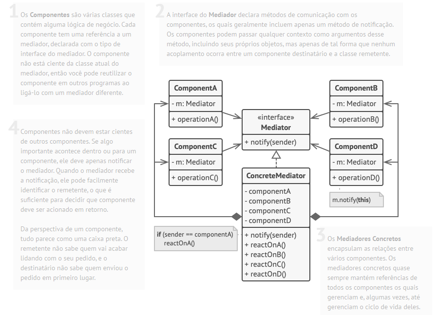
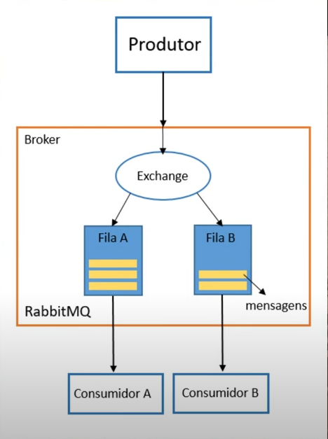

# **Design Patterns**
Intenção | Padrões
---------|----------
Interfaces      | Adpater, Facade, Composite
Responsabilidade      | Singleton, Observer, Mediator, Chain of Responsability
Construção      | Builder, Factory, Abstract Factory
Operações      | Strategy, Command, Interpreter
Extensões | Decorator, Iterator, Visitor

* Os **padrões criacionais** fornecem mecanismos de criação de objetos que aumentam a flexibilidade e a reutilização de código.
* Os **padrões estruturais** explicam como montar objetos e classes em estruturas maiores, enquanto ainda mantém as estruturas flexíveis e eficientes.
* Os **padrões comportamentais** cuidam da comunicação eficiente e da assinalação de responsabilidades entre objetos.

## **Factory Method**
O Factory Method é um **padrão criacional** de projeto que fornece uma interface para criar objetos em uma superclasse, mas permite que as subclasses alterem o tipo de objetos que serão criados.

O padrão Factory Method sugere que você substitua chamadas diretas de construção de objetos (usando o operador *new*) por chamadas para um método fábrica especial.

### **Aplicabilidade**:
*  Quando não souber de antemão os tipos e dependências exatas dos objetos com os quais seu código deve funcionar.
*  Quando desejar fornecer aos usuários da sua biblioteca ou framework uma maneira de estender seus componentes internos.
*  Quando deseja economizar recursos do sistema reutilizando objetos existentes em vez de recriá-los sempre.

### **Prós e contras**
Prós | Contras
---------|----------
Você evita acoplamentos firmes entre o criador e os produtos concretos. | O código pode se tornar mais complicado, pois você precisa introduzir muitas subclasses novas para implementar o padrão. O melhor cenário é quando você está introduzindo o padrão em uma hierarquia existente de classes criadoras.
Princípio de responsabilidade única. Você pode mover o código de criação do produto para um único local do programa, facilitando a manutenção do código. |
Princípio aberto/fechado. Você pode introduzir novos tipos de produtos no programa sem quebrar o código cliente existente. | 

### **Estrutura**

## **Abstract Factory**
O Abstract Factory é um padrão de **projeto criacional** que permite que você produza famílias de objetos relacionados sem ter que especificar suas classes concretas.

A primeira coisa que o padrão Abstract Factory sugere é declarar explicitamente interfaces para cada entidade de determinado tipo (ex: cadeira, sofá ou mesa de centro). Então você pode fazer todas as variantes da entidade seguirem essas interfaces. Por exemplo, todas as variantes de cadeira podem implementar a interface Cadeira; todas as variantes de mesa de centro podem implementar a interface MesaDeCentro, e assim por diante.

### **Aplicabilidade**
* Use o Abstract Factory quando seu código precisa trabalhar com diversas famílias de produtos relacionados, mas que você não quer depender de classes concretas daqueles produtos-eles podem ser desconhecidos de antemão ou você simplesmente quer permitir uma futura escalabilidade.
* Considere implementar o Abstract Factory quando você tem uma classe com um conjunto de métodos fábrica que desfoquem sua responsabilidade principal.

### **Prós e contras**
Prós | Contras
---------|----------
Você pode ter certeza que os produtos que você obtém de uma fábrica são compatíveis entre si. | O código pode tornar-se mais complicado do que deveria ser, uma vez que muitas novas interfaces e classes são introduzidas junto com o padrão.
Você evita um vínculo forte entre produtos concretos e o código cliente. | 
Princípio de responsabilidade única. Você pode extrair o código de criação do produto para um lugar, fazendo o código ser de fácil manutenção. |
Princípio aberto/fechado. Você pode introduzir novas variantes de produtos sem quebrar o código cliente existente. | 

### **Estrutura**

## **Chain of Responsibility**
O Chain of Responsibility é um padrão de **projeto comportamental** que permite que você passe pedidos por uma corrente de *handlers*. Ao receber um pedido, cada handler decide se processa o pedido ou o passa adiante para o próximo handler na corrente.

Como muitos outros padrões de projeto comportamental, o Chain of Responsibility se baseia em transformar certos comportamentos em objetos solitários chamados handlers.
O padrão sugere que você ligue esses handlers em uma corrente. Cada handler ligado tem um campo para armazenar uma referência ao próximo handler da corrente. Além de processar o pedido, handlers o passam adiante na corrente. O pedido viaja através da corrente até que todos os handlers tiveram uma chance de processá-lo.
E aqui está a melhor parte: um handler pode decidir não passar o pedido adiante na corrente e efetivamente parar qualquer futuro processamento.

* Handlers estão alinhados um a um, formando uma corrente.

* Uma corrente pode ser formada por uma secção de um objeto.

### **Aplicabilidade**
* Utilize o padrão Chain of Responsibility quando é esperado que seu programa processe diferentes tipos de pedidos em várias maneiras, mas os exatos tipos de pedidos e suas sequências são desconhecidos de antemão.
* Utilize o padrão quando é essencial executar diversos handlers em uma ordem específica.
* Utilize o padrão CoR quando o conjunto de handlers e suas encomendas devem mudar no momento de execução.

### **Prós e contras**
Prós | Contras
---------|----------
Você pode controlar a ordem de tratamento dos pedidos. | Alguns pedidos podem acabar sem tratamento.
Princípio de responsabilidade única. Você pode desacoplar classes que invocam operações de classes que realizam operações. | 
Princípio aberto/fechado. Você pode introduzir novos handlers na aplicação sem quebrar o código cliente existente. |

### **Estrutura**

## **Strategy**
O Strategy é um padrão de **projeto comportamental** que permite que você defina uma família de algoritmos, coloque-os em classes separadas, e faça os objetos deles intercambiáveis.

O padrão Strategy sugere que você pegue uma classe que faz algo específico em diversas maneiras diferentes e extraia todos esses algoritmos para classes separadas chamadas estratégias.
A classe original, chamada contexto, deve ter um campo para armazenar uma referência para um dessas estratégias. O contexto delega o trabalho para um objeto estratégia ao invés de executá-lo por conta própria.

O contexto não é responsável por selecionar um algoritmo apropriado para o trabalho. Ao invés disso, o cliente passa a estratégia desejada para o contexto. Na verdade, o contexto não sabe muito sobre as estratégias. Ele trabalha com todas elas através de uma interface genérica, que somente expõe um único método para acionar o algoritmo encapsulado dentro da estratégia selecionada.
Desta forma o contexto se torna independente das estratégias concretas, então você pode adicionar novos algoritmos ou modificar os existentes sem modificar o código do contexto ou outras estratégias.

### **Aplicabilidade**
* Utilize o padrão Strategy quando você quer usar diferentes variantes de um algoritmo dentro de um objeto e ser capaz de trocar de um algoritmo para outro durante a execução.
* Utilize o Strategy quando você tem muitas classes parecidas que somente diferem na forma que elas executam algum comportamento.
* Utilize o padrão para isolar a lógica do negócio de uma classe dos detalhes de implementação de algoritmos que podem não ser tão importantes no contexto da lógica.
* Utilize o padrão quando sua classe tem um operador condicional muito grande que troca entre diferentes variantes do mesmo algoritmo.

### **Prós e contras**
Prós | Contras
---------|----------
Você pode trocar algoritmos usados dentro de um objeto durante a execução. | Se você só tem um par de algoritmos e eles raramente mudam, não há motivo real para deixar o programa mais complicado com novas classes e interfaces que vêm junto com o padrão.
Você pode isolar os detalhes de implementação de um algoritmo do código que usa ele. | Os Clientes devem estar cientes das diferenças entre as estratégias para serem capazes de selecionar a adequada.
Você pode substituir a herança por composição. | Muitas linguagens de programação modernas tem suporte do tipo funcional que permite que você implemente diferentes versões de um algoritmo dentro de um conjunto de funções anônimas. Então você poderia usar essas funções exatamente como se estivesse usando objetos estratégia, mas sem inchar seu código com classes e interfaces adicionais.
Princípio aberto/fechado. Você pode introduzir novas estratégias sem mudar o contexto. | 

### **Estrutura**

## **Mediator**
O Mediator é um padrão de **projeto comportamental** que permite que você reduza as dependências caóticas entre objetos. O padrão restringe comunicações diretas entre objetos e os força a colaborar apenas através do objeto mediador.

O padrão Mediator sugere que você deveria cessar toda comunicação direta entre componentes que você quer tornar independentes um do outro. Ao invés disso, esses componentes devem colaborar indiretamente, chamando um objeto mediador especial que redireciona as chamadas para os componentes apropriados. Como resultado, os componentes dependem apenas de uma única classe mediadora ao invés de serem acoplados a dúzias de outros colegas.

Dessa forma, o padrão Mediator permite que você encapsule uma complexa rede de relações entre vários objetos em apenas um objeto mediador. Quanto menos dependências uma classe tenha, mais fácil essa classe se torna para se modificar, estender, ou reutilizar.

### **Aplicabilidade**
* Utilize o padrão Mediator quando é difícil mudar algumas das classes porque elas estão firmemente acopladas a várias outras classes.
* Utilize o padrão quando você não pode reutilizar um componente em um programa diferente porque ele é muito dependente de outros componentes.
* Utilize o Mediator quando você se encontrar criando um monte de subclasses para componentes apenas para reutilizar algum comportamento básico em vários contextos.

### **Prós e contras**
Prós | Contras
---------|----------
Princípio de responsabilidade única. Você pode extrair as comunicações entre vários componentes para um único lugar, tornando as de mais fácil entendimento e manutenção. | Com o tempo um mediador pode evoluir para um **Objeto Deus**.
Princípio aberto/fechado. Você pode introduzir novos mediadores sem ter que mudar os próprios componentes. | 
Você pode reduzir o acoplamento entre os vários componentes de um programa. | 
Você pode reutilizar componentes individuais mais facilmente. | 

### **Estrutura**

## **Command**
O Command é um padrão de projeto comportamental que transforma um pedido em um objeto independente que contém toda a informação sobre o pedido. Essa transformação permite que você parametrize métodos com diferentes pedidos, atrase ou coloque a execução do pedido em uma fila, e suporte operações que não podem ser feitas.

O padrão Command sugere que os objetos GUI não enviem esses pedidos diretamente. Ao invés disso, você deve extrair todos os detalhes do pedido, tais como o objeto a ser chamado, o nome do método, e a lista de argumentos em uma classe comando separada que tem apenas um método que aciona esse pedido.
Como resultado, os comandos se tornam uma camada intermédia conveniente que reduz o acoplamento entre as camadas GUI e de lógica do negócio. 

### **Aplicabilidade**
* Utilize o padrão Command quando você quer parametrizar objetos com operações.
* Utilize o padrão Command quando você quer colocar operações em fila, agendar sua execução, ou executá-las remotamente.
* Utilize o padrão Command quando você quer implementar operações reversíveis.

### **Prós e contras**
Prós | Contras
---------|----------
Princípio de responsabilidade única. Você pode desacoplar classes que invocam operações de classes que fazem essas operações. | O código pode ficar mais complicado uma vez que você está introduzindo uma nova camada entre remetentes e destinatários.
Princípio aberto/fechado. Você pode introduzir novos comandos na aplicação sem quebrar o código cliente existente. | 
Você pode implementar desfazer/refazer. | 
Você pode implementar a execução adiada de operações. | 
Você pode montar um conjunto de comandos simples em um complexo. |

### **Estrutura**

## **Dependency injection**
Podemos dizer que a injeção de dependência é uma inversão de controle, uma vez que não mais seu business realiza a instanciação de classes, mas sim quem está consumindo a classes, passando a responsabilidade de definir qual instância será utilizada para um “agente externo”.

* Uso benéfico de interfaces.
* Menor acoplamento.
* Um objeto implementar várias interfaces, ou seja, várias dependências injetadas.
* Facilita evolução do objeto.

## **Reflection**
Vale notar que Reflection não é considerado um Design Pattern.

* Manipulador de classes, obter informações de classes, etc…
* Utilizado em tempo de execução do programa.

## **Implementações de Design Patterns em Java**
[Exemplos em Java](https://refactoring.guru/pt-br/design-patterns/java)

[Fontes](https://refactoring.guru/pt-br/design-patterns/catalog)

# **Ecossistema Spring**
Spring Boot é uma ferramenta que nasceu do framework Spring, baseado em design patterns de inversão de controle e injeção de dependência. 

No geral, ele fornece a maioria dos componentes necessários em aplicações em geral de maneira pré-configurada, possibilitando uma aplicação rodando em produção rapidamente, com o esforço mínimo de configuração e implantação.
Em outras palavras, podemos entender o Spring Boot como um template pré-configurado para desenvolvimento e execução de aplicações baseadas no Spring.

* Oferecer uma experiência de início de projeto rápida e direta.
* Apresentar uma visão opinativa e flexível sobre o modo como os projetos Spring devem ser configurados.
* Fornecer requisitos não funcionais pré-configurados.
* Não prover geração de código e zerar a necessidade de arquivos XML.

Dentre o Spring framework, pode-se dividir em 7 grupos

* Core Container;
* Data Access/Integration;
* Web;
* Aspect Oriented Programming (AOP);
* Instrumentation;
* Messaging;
* Test;

Core Container → Responsáveis por conter funcionalidades fundamentais como classes básicas e avançadas, assim como configurações por anotações ou XML.

Data Access / Integration → Funcionalidades para transação com banco de dados.

Web → Recursos web como implementação de MVC, Web Services, REST.

Módulo AOP → Implementação para programação orientada a aspectos, em resumo, mensageria de microsserviços.

Test → Testes unitários utilizando JUnit, e testes de integração.

## **Beans :** 
Dentro do Spring Framework, faz-se utilização da injeção de dependência, na qual a implementação está presente no Core Container. Quando a aplicação é executada, as configurações pré-definidas em classes ou arquivos XML são lidas e criadas através da inversão de controle, sendo criadas e destruídas durante a execução do projeto. Essas dependências são chamadas de Beans dentro do contexto Spring.

**Bean com a anotação do tipo @Component, @Service, @Controller**

Bean do tipo Component :
~~~~Java
@Component
public class Produto{
    private String nome;
    private BigDecimal valor;
    //... Getters e Setters
}
~~~~

Bean do tipo Service :
~~~~Java
@Service
public class ProdutoService{
    //... Regras de negócios
}
~~~~

Bean do tipo Controller :
~~~~Java
@Controller
public class ProdutoContollers{
    //... POST, GET, PUT, DELETE
}
~~~~

Bean do tipo Repository :
~~~~Java
@Repository
public class ProdutoRepository{
    //... Transações de banco de dados
}
~~~~

É necessário entender aoned que o Spring ira injetar as instânciaas de depedências, por isso é necessário criar pontos de injeção, que é uma maneira de entregar as dependências ao objeto o que necessitar.

Injeção de Dependências através de **Construtor** :
~~~~Java
@Service
public class ProdutoService{
    private ProdutoRepository produtoRepository;

    public ProdutoService(ProdutoRepository produtoRepository){
        this.produtoRepository = produtoRepository;
    }

    //... Regras de negócios
}
~~~~

Injeção de Dependências através de **Setter** :
~~~~Java
@Service
public class ProdutoService{
    private ProdutoRepository produtoRepository;

    public void setProdutoRepository(ProdutoRepository produtoRepository){
        this.produtoRepository = produtoRepository;
    }

    //... Regras de negócios
}
~~~~

Dentro do Spring, há uma outra maneira de se criar pontos de injeção de 
forma automática, utilizando a anotação **@Autowired**:

~~~~Java
@Service
public class ProdutoService{

    @Autowired
    private ProdutoRepository produtoRepository;

    //... Regras de negócios
}
~~~~

## **Spring Boot :**
O Spring Boot é uma extensão do Spring, utilizando bases do Spring para iniciar uma aplicação de uma forma bem mais simplificada, também já trazendo um servidor embutido.

## **API REST e RESTful :**
É uma aplicação cliente/servidor que envia e recebe dados através do protocolo HTTP, utilizando XML e Json para comunicação, permitindo que diferentes sistemas como desktop e mobile consumam a mesma API.
Uma API pode ser considerada RESTful, quando utiliza-se de conceitos arquiteturais REST.

REST → REST é um conjunto de boas práticas que é capaz de gerar maior produtividade na construção e no consumo da API. Essas regras devem ser seguidas
* API deve ser cliente/servidor.
* Deve ser stateless, ou seja, cada requisição deve ter informações únicas para cada resposta.
* API deve ter capacidade de realizar cache para reduzir tráfego de dados entre cliente/servidor.
* Deve ter uma interface uniforme.
* Construído em camadas, possibilitando escalabilidade.
* Deve ter capacidade de evoluir sem prejudicá-la.
* A API rest deve possuir dois tipos de comunicação, XML e JSON.

**Criando uma Model e Repository em Spring :**

~~~~Java
@Entity
@Table(name= "TB_PRODUTOS")
public class ProdutoModel{

    @Id
    @GenereatedValue(strategy = GenerationType.AUTO)
    private UUID idProduto;

    private String nome;
    private BigDecimal valor;

    //... Getters e Setter;
}
~~~~

**Criação de uma interface de Repository utilizando JPA, para obter métodos como findAll(), findById(), save(), delete()**

~~~~Java
@Repository
public interface ProdutoRepository extends JpaRepository<ProdutoModel, UUID>{

}
~~~~

**Criando o Controller utilizando Beans, assim uma injeção de dependência do Controller quando necessário.**

*Obtendo todos produtos findAll()*
~~~~Java
@RestController
public class ProdutoController{
    @Autowired
    ProdutoRepository produtoRepository;

    @GetMapping("/produtos")
    public ReponseEntity<List<ProdutoModel>> getAllProdutos(){
        return new ResponseEntity<List<ProdutoModel>>(produtoRepository.findAll(), HttpStatus.OK);
    }
}
~~~~

*Obtendo um produto findById()*
~~~~Java
@RestController
public class ProdutoController{
    @Autowired
    ProdutoRepository produtoRepository;

    @GetMapping("/produtos/{id}")
    public ReponseEntity<ProdutoModel>getOneProduto(@PathVariable(value="id") UUID id){
        Optional<ProdutoModel> produtoOptional = produtoRepository.findById(id);
        if(produtoOptional.isEmpty()){
            return new ReponseEntity<>(HttpStatus.NOT_FOUND);
        }
        return new ResponseEntity<ProdutoModel>(produtoOptional.get(), HttpStatus.OK);
    }
}
~~~~

*Método POST*
~~~~Java
@RestController
public class ProdutoController{
    @Autowired
    ProdutoRepository produtoRepository;

    @PostMapping("/produtos")
    public ResponseEntity<ProdutoModel> saveProduto(@RequestBody @Valid ProdutoModel produto){
        return new ResponseEntity<ProdutoModel>(produtoRepository.save(produto), HttpStatus.CREATED);
    }
}
~~~~

*Método PUT*
~~~~Java
@RestController
public class ProdutoController{
    @Autowired
    ProdutoRepository produtoRepository;

    @PutMapping("/produtos/{id}")
    public ResponseEntity<ProdutoModel> updateProduto(@PathVariable(value="id") UUID id, @RequestBody @Valid ProdutoModel produto){
        Optional<ProdutoModel> produtoOptional = produtoRepository.findById(id);
        if(produtoOptional.isEmpty()){
            return new ReponseEntity<>(HttpStatus.NOT_FOUND);
        }
        produto.setIdProduto(produto.get().getIdProduto());
        return new ResponseEntity<ProdutoModel>(produtoRepository.save(produto), HttpStatus.OK);
    }
}
~~~~

*Método DELETE*
~~~~Java
@RestController
public class ProdutoController{
    @Autowired
    ProdutoRepository produtoRepository;

    @PutMapping("/produtos/{id}")
    public ResponseEntity<?> deleteProduto(@PathVariable(value="id") UUID id){
        Optional<ProdutoModel> produtoOptional = produtoRepository.findById(id);
        if(produtoOptional.isEmpty()){
            return new ResponseEntity<>(HttpStatus.NOT_FOUND);
        }
        produtoRepository.delete(produtoOptional.get());
        return new ResponseEntity<>(HttpStatus.OK);
    }
}
~~~~

## **Java JPA :**
Java Persistence API (JPA) é a especificação padrão da plataforma Java EE para mapeamento objeto-relacional e persistência de dados.

# **SOLID**

## **Princípio da Responsabilidade Única (SRP)**
*“Uma classe deve ter apenas um motivo para mudar”*

Cada classe deve fazer apenas um trabalho. Portanto, isso significa que uma classe deve ter um, e somente um, motivo para mudar.
Veja o exemplo:

~~~~Java
public class Usuario{
    private String email;
    private String senha;

    //... Getters e Setter

    public boolean usuarioEhValido(){
        //Regra de autenticação
    }
    
    public boolean temCargo(){
        //Regra de validação de cargo
    }
}
~~~~

No exemplo acima, temos que a classe Usuario implementa regras de negócios de validações diferentes, deixando fortemente acoplado a classe em ralação as regras de negócios.
Podemos aplicar o princípio da responsabilidade única para desacoplar o máximo possível.

~~~~Java
public class Usuario {
    private String email;
    private String senha;

    //... Getters e Setter
}

public class PermissaoService{

    public boolean temCargo(){
        //Regra de validação de cargo
    }
}

public class ValidacaoService{

    public boolean usuarioEhValido(){
        //Regra de autenticação
    }
}
~~~~

## **Princípio do Aberto/Fechado (OCP)**
*"“As entidades de software (classes, módulos, funções etc.) devem ser abertas para ampliação, mas fechadas para modificação”.*

**Aberto para extensão** diz que você deve projetar suas classes para que novas funcionalidades possam ser adicionadas à medida que novos requisitos são gerados.

**Fechado para modificação** significa que uma vez que uma classe tenha sido desenvolvida ela nunca deve ser modificada, exceto para corrigir bugs e demais problemas no código.

~~~~Java
public class Funcionario {
    //... Getters e Setter
}

public class ContratoCLT extends Funcionario{
    public float salario(){
        return 3000;
    }
}

public class Estagio extends Funcionario{
    public float salario(){
        return 1000;
    }
}

public class FolhaPagamento{
    protected float saldo;
    public void calcular(Funcionario funcionario){
        if(funcionario instanceof ContratoCLT){
            this.saldo = ((ContratoCLT) funcionario).saldo();
        }else if(funcionario instanceof Estagio){
            this.saldo = ((Estagio) funcionario).bolsaAuxiliar();
        }
    }
}
~~~~

O código exemplificado fere gravemente o princípio open /close, uma vez que é necessário sempre acrescentar sempre uma condicional a mais para expandir a regra de negócio. Vale notar o design patern Strategy que lida justamente com a expensão de novas models para o sistema, reforçando o principio de open / closed.

~~~~Java
public interface Remuneravel{
    public float remuneracao();
}

public class ContratoCLT implements Remuneravel{
    public float remuneracao(){
        return 3000;
    }
}

public class Estagio implements Remuneravel{
    public float remuneracao(){
        return 3000;
    }
}

public class FolhaPagamento{
    protected float saldo;
    public void calcular(Remuneravel funcionario){
        this.saldo = funcionario.remuneracao();
    }
}
~~~~

## **Princípio da Substituição de Liskov (LSP)**
*Os subtipos devem ser substituíveis pelos seus tipos base.”*

Isto é, classes derivadas podem ser substitutas de suas classes base, ou ainda: toda e qualquer classe derivada pode ser usada como se fosse a classe base.

Assim, todo código que depende da classe base poderá usar qualquer uma das derivadas em tempo de execução mesmo sem saber da existência delas.

~~~~Java
public class A{
    public String getNome(){
        return "Meu nome é A";
    }
}

public class B extends A{
    @Override
    public String getNome(){
        return "Meu nome é B";
    }
}

public class Main{
    public static void main(String[] args){
        A objA = new A();
        B objB = new B();
        imprimeNome(objA);
        imprimeNome(objB);
    }

    public static void imprimeNome(A obj){
        System.out.println(obj.getNome());
    }
}
~~~~

## **Princípio da Segregação de Interfaces (ISP)**
*“muitas interfaces específicas são melhores do que uma interface geral”.*

Esse princípio trata da coesão em interfaces, da construção de módulos enxutos, ou seja, com poucos comportamentos, de acordo com esse princípio, uma classe nunca deve ser obrigada a implementar interfaces e métodos que ela não usará.

~~~~Java
public interface Aves{
    public void setLocalizacao(float longitude, float latitude);
    public void setAltitude(float altitude);
}

public class Papagaio() implements Aves{
    public void setLocalizacao(float longitude, float latitude){
        // Regra de negócio
    }

    public void setAltitude(float altitude){
        // Regra de negócio
    }
}

public class Galinha() implements Aves{
    public void setLocalizacao(float longitude, float latitude){
        // Regra de negócio
    }

    public void setAltitude(float altitude){
        // Regra de negócio
    }
}
~~~~

Fica evidente como atribuímos comportamentos genéricos para todas as demais classes. A Classe Galinha, por exemplo, acabou sendo forçada a ter o método “setAltitude”, situação que não deveria acontecer pois os galinhas não voam.

~~~~Java
public interface Aves{
    public void setLocalizacao(float longitude, float latitude);
}

public interface AvesQueVoam extends Aves{
    public void setAltitude(float altitude);
}

public class Papagaio() implements AvesQueVoam{
    public void setLocalizacao(float longitude, float latitude){
        // Regra de negócio
    }

    public void setAltitude(float altitude){
        // Regra de negócio
    }
}

public class Galinha() implements Aves{
    public void setLocalizacao(float longitude, float latitude){
        // Regra de negócio
    }
}
~~~~

## **Princípio da Inversão de Dependências (DIP)**
*“depender de abstrações e não de classes concretas.”*

Diz que devemos “depender de abstrações e não de classes concretas”. Uncle Bob quebra a definição desse princípio em dois sub-itens:

* *“Módulos de alto nível não devem depender de módulos de baixo nível.”*
* *“As abstrações não devem depender de detalhes. Os detalhes devem depender das abstrações.”*

Seja o exemplo:

~~~~Java
public class Carro{
    private Engine engine;
    public Carro(Engine engine){
        this.engine = engine;
    }

    public void start(){
        engine.start;
    }
}

public class Engine{
    public void start(){
        // Regra de negócio
    }
}
~~~~

O código não permite que utilize-se de um outro tipo de Engine, está fortemente acoplado, para resolver isso, aplica-se uma interface de Engine.

~~~~Java
public interface Engine{
    public void start();
}

public class GasolinaEngine implements Engine{
    public void start();
}

public class DiselEngine implements Engine{
    public void start();
}

public class Carro{
    private Engine engine;
    public Carro(Engine engine){
        this.engine = engine;
    }

    public void start(){
        engine.start;
    }
}
~~~~

# **Clean Architecture**

A arquitetura limpa é idealização para uma construção de um software robusto, para isso é definido um conjunto de regras para a padronização para realizar um único objetivo de **separar as preocupações do software**. 

Dividi-se a arquitetura em camadas, camadas de regras de negócios e de interfaces de usuários. Possúem as seguintes características.

* **Independência de Framework** → Implica que a arquitetura não deve depender de nenhuma ferramente externa a línguagem (frameworks, bibliotecas), devem ser anexas ao projeto e não baseadas nelas.
* **Testabilidade** → As regras de negócio do projeto devem ter a possibilidade de serem testadas sem a necessidade de um banco de dados, interfaces, etc...
* **Independencia da Interface do Usuário** → A interface do usuário deve ser facilmente substituídas sem a necesscidade de alterar as regras de negócios.
* **Independência do Banco de Dados** → Os bancos de dados não estão ligados ao projeto, podem ser alterados sem alterar as regras de negócio, exemplo de mudar de Postgres para MySql.
* **Independência de Qualquer Elemento Externo** → As regras de negócios não devem saber **NADA** das interfaces com o mundo externo.

# **Redes**

## **HTTP**
O protocolo HTTP está na camada de aplicação, de modo que cabe a aplicação implementar o protocólo como ferramente da sistema.
Além disso, o protocólo HTTP funciona apenas com a utilização de outros dois protócolos:

* TCP → Transmission Control Protocol, resonsável pela transferência das informações.
* IP → Internet Protocol, Encaminhamento dos dados.

HTTP segue o modelo de **Request** e **Response**, além de uma conexão não persistente, sendo necessário abrir sempre uma nova conexão entre cliente e servidor toda vez que uma requisição acontecer.

Dentro de uma requisição, contém três conteúdos:
* Linha de Pedido: Identificador (POST, GET, DELETE, PUT...), URI, Versão do protocolo.
* Cabeçalho. Cookies, etc..
* Corpo/Mensagem: Dados da requisição

Como citado, há diferentes tipos de identificadores de requisição, os mais utilizado são POST, GET, DELETE E PUT:

* GET → Requisições simples, contém apenas as informações obtidas, e não deve apresentar modificação nos dados (apenas "visualiza").
* POST → Modifica o dado desejado criando um novo item daquela entidade, como por exemplo a criação de um novo funcionário.
* PUT → Modifica o dado desejado alterando um item já existente.
* DELETE → Remove um dado ja existente.

## **Status**
O código de status dentro do HTTP corresponde a resposta se a requisição foi bem sucedida ou não.

É definido através de familias a quais os determinados códigos pertencem, sendo dividido em 5 familias os status.

1. (1xx) Informacional → Indica que o pedido foi recebido e está sendo processado.
2. (2xx) Sucesso → Significa que o pedido de requisição foi recebido com sucesso, aceito e processado.
3. (3xx) Redirecionamento → Ações adicionais precisam ser completadas / informadas para completar o pedido.
4. (4xx) Client Error → Indica que o pedido está com informações incorretas e não é possível ser processado.
5. (5xx) Server Error → O servidor não conseguiu processar o pedido.

[Verifique cada status em específico clicando aqui](https://developer.mozilla.org/en-US/docs/Web/HTTP/Status?retiredLocale=pt-PT#information_responses)

# **Gitflow**
O Gitflow é um **workflow** (modelo, estratégia) que ajuda na organização no versionamento do código, organizando as **branchs** dentro do repositório, deixando bem definido novas **features** e **releases**.

Separamos o gitflow em 2 tipos de branchs:
1. Master → Contém o projeto principal. Vale notar que a cada merge da Release, é necessário criar uma nova tag (v1.0, v1.1, etc...).
2. Develop → É criada a partir da Master, irá conter todas novas features estáveis e releases. que serão mergeadas.

Branchs de suporte:
1. Feature → Para cada nova feature, uma nova branch é criada a partir da Develop, e voltará via merge para a develop quando estiver estável.
2. Release → A branch Release irá conter todas novas features funcionais, servindo de suporte e ponte entre Develop e Master 
3. Hotfix → Utiliazado em uma situação emergencial, quando finalizado, é mergeado direto na Master.

### **O que é o Pull Request?**

É um processo que notifica os membros desenvolvedores do projeto de que uma nova release foi completa, e esta release está aberta para verificação e possiveis futuras modificações. Basicamente é uma review do código antes de ser mergeada para a branch Master.

# **Deploy**
Podemos definir *deploy* como implantar, disponibilizar ou simplemeste **colocar no ar**.

O *deploy* pode ser:
* Manual → FTP (exemplo).
* Parcialmente Automatizado → Push (exemplo).
* Completamente Automatizado → Pode ser chamado de deploy contínuo, Jenkins (exemplo).

# **Callback**

O *callback* pode ser traduzido literalmente como *chamada de retorno* ou uma analogia como *me liga de volta rsrs*.

É uma função que é executada quando algum evento acontecer ou quando algum código é chegado em determinado estado desejado. 

Usualmente ela é assíncrona, e passada como argumento de outra função.

Vejamos abaixo um exemplo utilizando uma função em jQuery
~~~~jQuery
$(selector).hide(speed, callback);
~~~~

Observamos que a função hide espera um argumento que indica velocidade em que a tag irá se esconder, e logo após a ação de hide, é executado algo, esse algo chamamos de callback.

~~~~jQuery
$('#minhaDiv').hide(2000, mensagem());

function mensagem(){
    alert('div sumiu');
}
~~~~

# **Arquitetura de Microservices**
**Arquitetura monolítica**: Baseia-se em vários módulos e funcionalidades que compõe um único softwares, um grande bloco de código, na qual tem todas as funcionalidades e regras de negócios do sistema. Usualmente uma aplicação monolítica também possui apenas uma base de dados que armazena informações de todo o sistem. Um exemplo de arquitetura monolítica é o sistema ERP.

Uma arquitetura de microsserviços é construiído a partir de vários serviços pequenos e com objetivo claro, sendo independentes-entre si, para cada módulo, tem sua própria base de dados e regras de negócios específicas para cada módulo.

Uma grande vatangem da arquitetura de microsserviço em relação a monolítica é a facilidade de se acrescentar novas features, uma vez que cada feature é específica de cada módulo, e interfere na regra de negócio apenas daquele modulo. Outra grande vatagem é que em caso de alguma mudança ou manutenção de um módulo em microsserviço, apenas aquele módulo é pausado enquanto os outros podem continuar sendo executados da mesma maneira, existindo um forte desacoplamento entre os serviços.

# **Comunicação entre Microservices**
Na comunicação entre microsserviços, existem dois tipos de comunicações que podem ser realizadas entre cada micrisserviço, essas comunicações são:
* Síncrona.
* Assícrona.

**Comuinicação Síncrona:** Quando trata-se de comunicação síncrona, a primeira ideia que tem que vir em mente é o protocolo **HTTP**, esse protocolo irá enviar uma requisição e receber uma resposta, utilizando o padrão **REST** (Em Spring Boot, no Spring Framework existe uma biblioteca específica para utilizar-se de comuniação assíncrona, chamada de Spring Cloud Netflix, realizando todo o orquestramento entre os microsserviços).

Observe o exemplo mostrado, a aplicação Angular é o nosso cliente, ou seja, ela irá realizar requisições para o sistema com arquitetura de microsserviço. A requisição é feita para um microsserviço central (Gateway), uma vez que ele irá receber todas requisições da aplicação em uma única porta, para que ele determine qual microsserviço irá receber a requisição.

**Comuinicação Assíncrona:** Na comunicação assíncrona de microsserviços faz o uso de outro protocolo, chamdo de **AMQP**, através desse protocolo o microsserviço A envia uma mensagem para o microsserviço B, o microsserviço B não precisa responder a mensagem, apenas avisar o microsserviço A de que foi ouvido com sucesso a mensagem, continuando o processamento normalmente do sistema.

Para comunicação assíncrona, é utilizado mensagerias como **RabbitMq** e **Kafka**, sendo os mais conhecidos. Dentro do Spring Boot existe a biblioteca chamada Spring Cloud Stream.

No exemplo acima, temos uma requisição da interface Angular de alteração de nota de um aluno, é realizado uma requisição de PUT para alterar, na qual o microsserviço Gateway realiza o redirecionamento da requisição para o microsserviço de Controle de Nota para alterar no banco de dados, porém por regra de negócio, toda vez que uma alteração é feita em Nota, deve-se enviar um email para o aluno de que a nota foi alterada.

Para isso o microsserviço de Controle de Nota envia uma mensagem através do protocolo AMQP avisando de que o microsserviço de Envio de Email deve realiazr o envio.

Oque difere entre o síncrono e o assíncrono, é de que o Controle de Email não precisa devolver uma resposta para o Controle de Nota com a notificação de email, apenas uma verificação de que foi escutado a mensagem e depois o próprio microsserviço de Controle de Email realiza seu procedimento de envio.

Essa mensagem que o Controle de Nota envia para o Controle de Email é chamada de **Fila**

Abaixo contém um roadmap de microsserviços.

# **RabbitMQ**

O RabbitMQ que atua como *messsage broker*, ou seja, atua como intermediario na gestão de envios e recebimentos de mensagens de uma ou mais aplicações. O RabbitMQ trabalha com o envio dos principais padrões de protocolos (HTTP, AMQP, etc..) 

RabbitMQ é um gerenciador de mensageria, utilizando o protocolo *AMQP*, que consiste no envio e recebimento de mensagens de forma assíncrona, na qual a mensagem é colocado em uma *fila*, esperando a sua vez de ser executado. 

O funcionamento do RabbitMQ se da na seguinte maneira → O Produtor publica (publish) a mensagem e envia para a fila, e o Consumidor assina (subscribe) para receber aquele tipo de mensagem. A fila ao terminar de processar conhece para quem enviar a mensagem.

A mensagem se divide em duas partes:
* Label → Rótulo da mensagem, é através da label que o RabbitMQ conecta o Produtor com o Consumidor.
* Payload → Conteúdo da mensagem.

Vale lembrar que o Produtor não envia diretamente a mensagem para a fila, ele envia a mensagem para um Exchange e esse por sua vez é responsável por encaminhar para o Consumidor.

# **SQS**

*Simple Queue Service*, o funcionamento é através de filas, porém ao invés de ter um gerenciador dessa filas assim como no RabbitMQ, o Produtor envia mensagens para o SQS Queue, e os Consumidores realizam um *"pull"* dessas mensagens, ou seja, os próprios Consumidores que estão escutando irão puxar as mensagens para sí, a fila não envia automaticamente a mensagem.

# **Kafka**

Pode ser denomidada de uma plataforma de *streaming de eventos*. Também podemos definir o Kafka como um barramento de mensagens que possuir alto processamento, porém trabalha apenas com mensagens primitivas (strings) e mensagens binárias.

* Event Streaming → Forma de capturar, analisar e responder eventos em tempo real. Garante o fluxo contínuo de dados.

Normalmente o Kafka é utilizado em dois tipo de aplicações:
1. As que necessitam de pipeline de streaming em tempo real, que obtém dados de sitemas / aplicativos de maneira confiável.  
2. As que necessitam de pipeline de streaming em tempo real, que transformam ou reagem ao fluxo de dados.

O Kafka possui Produtores que enviam mensagens para um *cluster* do Kafka, essa mensagem é redirecionada para um *broker* que possui um *tópico* que é dividio em várias particões. Os Consumidores são inscritos nessas partições, e eles devem realizar um *pull* para buscar essas mensagens dentro das partições.

Os tópicos são:
* *Multi-Producer* → Pode ter de O a N Produtores escrevendo eventos. 
* *Multi-Subscriber* → Pode ter de O a N Consumidores incritos no tópico.

# **Diferenças entre RabbitMQ e Kafka**

No RabbitMQ existe o conceito de Consumidores competitivos, ou seja, dois ou mais Consumidores querem consumir uma fila, e o RabbitMQ irá enviar apenas para um Consumidor.

Já no Kafka, todos Consumidores inscritos em um tópico, estando em partições diferentes, podem consumir a mesma mensagem. São chamado de múltiplos Consumidores.

Outro ponto, é o RabbitMQ é apenas um intermediador de mensagens, ou seja, ele não guarda nenhuma mensagem. No Kafka possui um log na qual armazena as mensagem por determinado tempo de forma customizavel

# **Containers**

São uma forma de virtualização, que permite usar múltiplos sistemas operacionais em apenas um sistema operacional. Porém difere muito de uma máquina virtual, uma vez que **cada** sistema opercional utilizado, faz o uso do **mesmo** kernel do linux.

A ideia é que cada container faça **uma** coisa, e assuma apenas **uma** responsabilidade.

# **Docker**

Docker oferece containers virtuais, que empacotam suas aplicações e dependências para dentro de um containers, tornando-se portável para qualquer máquina ou servidor.

Todas as configurações que a aplicação necessita para a portabilidade é definida uma vez, e é chamada de **imagem**, uma imagem pode ser definida como um *modelo* que é configurado o sistema operacional, dependências e regras e disponibilizada para uso nos containers, ou seja, é executado uma imagem docker dentro de um ou mais containers.

## **Docker Compose**

A ideia do Docker Compose é ter uma solução "multi-container" que é possível definir os serviços que deseja executar, e cada serviço é um container. Em resumo, o Docker Compose é uma forma de gerenciar multiplos containers, configurando de maneira facilitada todos containers, evitando repetição de processo. Podemos considerear o Docker Compose um orquestrador de containers.

* Qual a diferença entre Docker Compose e Kubernetes? → A principal diferença é que o **Kubernetes** orquestra containers em **multiplos computadores**, virutais ou físicos. Já o Docker Compose orquestra apenas dentro de **um único kernel**. 
* Os arquivos de Docker Compose são em .yml (docker-compose.yml)

~~~~yml
version: '3'
services:
  web:
    build: .
    ports:
     - "8080:80"
  db:
    image: mysql
    ports:
    - "3306:3306"
    environment:
    - MYSQL_ROOT_PASSWORD=password
    - MYSQL_USER=user
    - MYSQL_DATABASE=demodb
~~~~

## **Docker File**

O Docker File é um meio utilizado para criar as própias imagens personalizadas.

# **CI / CD**

O CI / CD é uma prática feita para entregar softwares com frequência aos clientes, levando a automação nas etapas de desenvolvimento de aplicativos.

* **Integração Contínua (CI)**: essa parte garante que o novo código seja mesclado com o código existente e que os desenvolvedores verifiquem os bugs antes de fazer a introdução em um ambiente de produção.

* **Implantação Contínua (CD)**: essa parte significa que os desenvolvedores podem liberar seu trabalho sem esperar pela aprovação manual de outros membros da equipe ou gerentes. Esse fluxo de trabalho reduz o tempo de desenvolvimento, o que se traduz em maiores níveis de produtividade nas organizações.

Um pipeline de CI/CD é um conjunto de ferramentas de software usadas para automatizar o processo de construção e lançamento de produtos, indica uma sequência de fases para realização até que a versão final de um software esteja disponível.

## **DevOps**

DevOps é uma abordagem automatizada e design de plataforma que tem como objetivo aumentar a capacidade de resposta às mudanças por meio de entregas de serviços rápidas e de alta qualidade. A maioria das vezes, o pipeline CI / CD já integra a estrutura DevOps.

## **Jenkis**

Jenkis é um sistema de automação **OpenSource**, que realiza dos mais diversos tipos de tarefas, muito utilizado em processos CI / CD.

O Jenkis faz na prática as seguintes tarefas:
* Checkout de aplicações em um repositório logo após um commit.
* Executa processos de integrações contínuas (build, testes, performance, etc...).
* Gera logs apresentando os processos executados.
* Realiza deploy de forma automatizada.

## **CircleCL**

CircleCI é uma ferramenta que permite que as equipes liberem rapidamente o código em que confiam, automatizando o processo de compilação, teste e entrega para aplicativos moveis e da web, na nuvem ou em um próprio servidor privado. Ou seja, **CircleCI é uma ferramenta de integração contínua**

* Um grande benefício do CircleCL → Pode ser configurado para executar pipelines muito complexos com eficiência, com cache sofisticado, cache da camada docker, classes de recursos para execução em máquinas mais rápidas e preços de desempenho.

## **GitHub Actions**

GitHub Actions nada mais é do que um orquestrador de workflow. Através dele nós podemos construir um workflow com várias ações que vão descrever os passos necessários para compilar, testar, empacotar, criar releases e até fazer deploy do nosso sistema, facilitando muito o processo de automatização de builds e deploys dos nossos sistemas, pois tudo estará no mesmo repositório.

# **Banco de Dados**

## **Index**

Em banco de dados SQL, um **índice (ou index)** é uma **estrutura de dados** que permite realizar **pesquisas rápidas** em colunas específicas de uma tabela.

Você seleciona as colunas que deseja incluir no índice e executa sua pesquisa no índice, ao invés do conjunto de dados inteiro.
~~~~SQL
CREATE INDEX nome_index
ON nome_tabela (coluna1, coluna2, ...);
~~~~

Vale lembrar que o indíce pode ser único.

~~~~SQL
CREATE UNIQUE INDEX nome_index
ON nome_tabela (coluna1, coluna2, ...);
~~~~

## **MySQL**

MySQL é um sistema open-source de gerenciamento de base de dados relacional, ele armazena essas informações em “tabelas” separadas e as conecta com “chaves”, daí o seu nome relacional.

~~~~SQL
CREATE TABLE Pessoa (
    id_pessoa INT NOT NULL  AUTO_INCREMENT,
    nome VARCHAR(100) NOT NULL,
    idade int,
    id_endereco int NOT NULL
)

CREATE TABLE Endereco (
    id_endereco INT NOT NULL,
    rua VARCHAR (100),
    numero VARCHAR(5),
    bairro VARCHAR (100),
    cep VARCHAR (8)
)

ALTER TABLE Pessoa
ADD PRIMARY KEY (id_pessoa);

ALTER TABLE Endereco
ADD PRIMARY KEY (id_endereco);

ALTER TABLE Pessoa
ADD FOREIGN KEY (id_endereco) REFERENCES Endereco(id_endereco);
~~~~

## **MongoDB**

MongoDB é um banco de dados open source, orientado a documentos, e não-relacional, ou seja, é um NOSQL. Foi pensado para uma grande quantidade de dados, uma vez que ele suporta escalabilidade de melhor maneira do que bancos SQL, o MongoDB opera suas ações de forma assíncrona, permitindo que tenha um persistência extremamente otimizada.

* A grande utilização do banco de dados não-relacional MongoDB é juntamente com o NodeJs, por conta da serialização com o JavaScript.

RDBMS | MongoDB
---------|----------
Banco de Dados      | Banco de Dados
Tabela      | Coleção
Linha      | Documento
Coluna      | Campo
Junção de tabela | Documentos incorporados
Chave Primária | Chave Primária (chave padrão _id fornecida pelo próprio mongodb)

~~~~
use admin
db.createUser(
    {
        user: "Júlio",
        pwd: "123",
        roles : [{
            role: "userAdminAnyDatabase",
            db : "admin"
        },
        "readWriteAnyDatabase"
        ]
    }
)

db.usuarios.insert( {
        nome: "Júlio Schendroski",
        cidade: "Santa Bárbara D'Oeste",
        estado: "São Paulo"
    }
)

db.meudb.save(MeusDados)

db.usuarios.remove( { estado: "São Paulo" } )
~~~~

## **DynamoDB**

O Amazon DynamoDB, ou simplesmente DynamoDB, é um banco de dados chave-valor NoSQL, serverless (sem servidor), e totalmente gerenciado. Foi projetado para executar aplicações de alta performance em qualquer escala.

DynamoDB oferece:
* Segurança Integrada.
* Backups contínuos.
* Armazenamento em cache na memória
* Ferramentas de exportação de dados.

Sua estrutura tem semelhança com bancos de dados relacionais, apesar de ser uma banco de dado não relacional.
* Tabelas → O DynamoDB armazena dados em tabelas.
* Itens → Cada tabela contém zero ou mais itens, e cada item é um grupo de atributos identificável exclusivamente entre os outros itens.
* Atributos → Um atributo é um elemento de dados fundamental, são similares a colunas em bancos de dados relacionais.

## **Java 8**

* Melhorias nas interfaces → Agora as interfaces podem definir métodos static e métodos default, Por exemplo, o padrão forEach foi incluído na interface java.lang.Iterable.
* Interfaces funcionais → A característica mais importante das interfaces funcionais é que elas podem ser instanciadas por meio de lambdas.
* Lambdas
* java.util.stream → Fluxo de dados.

#### **Exemplo de utilização com uma expressão lambda**

~~~~Java
palavras.sort(Comparator.comparing(s -> s.length());
~~~~

#### **Stream**
Para criar um Stream com os elementos de nossa lista só precisamos chamar o método defaut .stream(), presente na interface Collection
Essa API traz uma forma mais funcional de trabalhar com nossas coleções. Ela possui diversos métodos, como o filter, map e reduce

* **Filtrando coleções**
#### **Exemplo de utilização com uma expressão lambda**

~~~~Java
palavras.stream()
        .filter(s -> s.length() < 6)
        .forEach(System.out::println)
~~~~

## **Domain Driven Design**

**Vale notar de não se tratar de um padrão de design ou um tipo de arquitetura.**

Nesse tópico vamos responder as seguintes perguntas:
* O que é Domain-Driven Design?
* Como você aplicaria Domain-Driven Design?

O DDD fornece uma estrutura para tomadas de decisões, combinando práticas de desenvolvimento de software e práticas de design.
centrara **PRINCIPALMENTE** na **LÓGICA DE NEGÓCIO**, ou seja, no **DOMÍNIO**, almejando **auxiliar todo o ciclo de desenvolvimento**
para refletir o real entendimento dos processos e regras de negócios.

O DDD apresenta duas principaís estratégias:
*Design Estratégico → Ajuda a resolver problemas relacionados a modelágem do software.
*Design Tático → Concentra-se no desenvolvimento do produto, focado nos detalhes da implementação.

Em resumo, o DDD tem o objetivo de tornar a equipe mais colaborativa e focada no que mais importa, gerando facilidades ao entender os complexos processos do negócio.
Vantagens como uma afetiva comunicação entre devs e especialistas de negócios, de forma que o código desenvolvido reflita o máximo possível o domínio.

