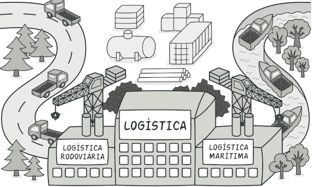

# **DESIGN PATTERNS**
<!--  -->
Intenção | Padrões
---------|----------
Interfaces      | Adpater, Facade, Composite
Responsabilidade      | Singleton, Observer, Mediator, Chain of Responsability
Construção      | Builder, Factory, Abstract Factory
Operações      | Strategy, Command, Interpreter
Extensões | Decorator, Iterator, Visitor

## **Strategy :**
Strategy permite que os algoritmos mudem independentemente entre os clientes que os utilizam.

* Padrão **Comportamental**.
* Quando precisa encapsular algoritmos similares para tomar alguma decisão.

Existem três entidades dentro do Strategy:
1. Estratégia (Interface)
2. Estratégia Concreta (Implementação do contrato da interface)
3. Contexto (Quem utiliza a estratégia)

Quando usar?
* Classes relacionadas forem diferentes **apenas** no **comportamento**.
* Quando uma classe define muitos **comportamentos**, e estes aparecem na forma de **condicional** em suas operações.

## **Factory :**
Factory Method permite que uma classe delegue a responsabilidade de instanciamento às subclasses

* Design Pattern de **Construção**.
* Desacopla o cliente dos tipos de produtos específicos.
*Remove da classe cliente todo conhecimento sobre as subclasses de produtos.
* Estende o programa de forma dinâmica.
* *Consequência negativa* → Aumenta o número de classes do sistema.

## **Abstract Factory :**
* Design Pattern de **Criação**.
* É uma Factory Method, porém composto por **múltiplas Factory Methods**.
* Visa agrupar família de produtos compativeis compativeis, criando assim uma factory divida por grupos.

Algumas consequência são levadas em conta, dentre delas:
* *Positivas* → Os produtos sempre são compatíveis, aplicação do Open-Closed (SOLID), e aplicação do Single Responsibility Principle (SOLID) ou seja, o código que cria está separado do que usa.
* *Negativos* → Muitas classes e maior complexidade.

## **Reflection :**
Vale notar que Reflection **não é considerado um Design Pattern.**
* Manipulador de classes, obter informações de classes, etc…
* Utilizado em tempo de execução do programa.

## **Dep. Injection :**
Podemos dizer que a injeção de dependência é uma inversão de controle, uma vez que não mais seu business realiza a instanciação de classes, mas sim quem está consumindo a classes, passando a responsabilidade de definir qual instância será utilizada para um “agente externo”.

* Uso benéfico de interfaces.
* Menor acoplamento.
* Um objeto implementar várias interfaces, ou seja, várias dependências injetadas.
* Facilita evolução do objeto.

## **Chain Of Responsibility :**
* É usado quando uma requisição precisa passar por uma **sequência de operações** até ser totalmente tratada.
* Desacopla quem envia a requisição de quem vai tratar a requisição.
* Muito utilizado em requisição HTTP.

# **ECOSISTEMA SPRING**
Spring Boot é uma ferramenta que nasceu do framework Spring, baseado em design patterns de inversão de controle e injeção de dependência. 

No geral, ele fornece a maioria dos componentes necessários em aplicações em geral de maneira pré-configurada, possibilitando uma aplicação rodando em produção rapidamente, com o esforço mínimo de configuração e implantação.
Em outras palavras, podemos entender o Spring Boot como um template pré-configurado para desenvolvimento e execução de aplicações baseadas no Spring.

* Oferecer uma experiência de início de projeto rápida e direta.
* Apresentar uma visão opinativa e flexível sobre o modo como os projetos Spring devem ser configurados.
* Fornecer requisitos não funcionais pré-configurados.
* Não prover geração de código e zerar a necessidade de arquivos XML.

Dentre o Spring framework, pode-se dividir em 7 grupos

* Core Container;
* Data Access/Integration;
* Web;
* Aspect Oriented Programming (AOP);
* Instrumentation;
* Messaging;
* Test;

Core Container → Responsáveis por conter funcionalidades fundamentais como classes básicas e avançadas, assim como configurações por anotações ou XML.

Data Access / Integration → Funcionalidades para transação com banco de dados.

Web → Recursos web como implementação de MVC, Web Services, REST.

Módulo AOP → Implementação para programação orientada a aspectos, em resumo, mensageria de microsserviços.

Test → Testes unitários utilizando JUnit, e testes de integração.

## **Beans :** 
Dentro do Spring Framework, faz-se utilização da injeção de dependência, na qual a implementação está presente no Core Container. Quando a aplicação é executada, as configurações pré-definidas em classes ou arquivos XML são lidas e criadas através da inversão de controle, sendo criadas e destruídas durante a execução do projeto. Essas dependências são chamadas de Beans dentro do contexto Spring.

**Bean com a anotação do tipo @Component, @Service, @Controller**

Bean do tipo Component :
~~~~Java
@Component
public class Produto{
    private String nome;
    private BigDecimal valor;
    //... Getters e Setters
}
~~~~

Bean do tipo Service :
~~~~Java
@Service
public class ProdutoService{
    //... Regras de negócios
}
~~~~

Bean do tipo Controller :
~~~~Java
@Controller
public class ProdutoContollers{
    //... POST, GET, PUT, DELETE
}
~~~~

Bean do tipo Repository :
~~~~Java
@Repository
public class ProdutoRepository{
    //... Transações de banco de dados
}
~~~~

É necessário entender aoned que o Spring ira injetar as instânciaas de depedências, por isso é necessário criar pontos de injeção, que é uma maneira de entregar as dependências ao objeto o que necessitar.

Injeção de Dependências através de **Construtor** :
~~~~Java
@Service
public class ProdutoService{
    private ProdutoRepository produtoRepository;

    public ProdutoService(ProdutoRepository produtoRepository){
        this.produtoRepository = produtoRepository;
    }

    //... Regras de negócios
}
~~~~

Injeção de Dependências através de **Setter** :
~~~~Java
@Service
public class ProdutoService{
    private ProdutoRepository produtoRepository;

    public void setProdutoRepository(ProdutoRepository produtoRepository){
        this.produtoRepository = produtoRepository;
    }

    //... Regras de negócios
}
~~~~

Dentro do Spring, há uma outra maneira de se criar pontos de injeção de 
forma automática, utilizando a anotação **@Autowired**:

~~~~Java
@Service
public class ProdutoService{

    @Autowired
    private ProdutoRepository produtoRepository;

    //... Regras de negócios
}
~~~~

## **Spring Boot :**
O Spring Boot é uma extensão do Spring, utilizando bases do Spring para iniciar uma aplicação de uma forma bem mais simplificada, também já trazendo um servidor embutido.

## **API REST e RESTful :**
É uma aplicação cliente/servidor que envia e recebe dados através do protocolo HTTP, utilizando XML e Json para comunicação, permitindo que diferentes sistemas como desktop e mobile consumam a mesma API.
Uma API pode ser considerada RESTful, quando utiliza-se de conceitos arquiteturais REST.

REST → REST é um conjunto de boas práticas que é capaz de gerar maior produtividade na construção e no consumo da API. Essas regras devem ser seguidas
* API deve ser cliente/servidor.
* Deve ser stateless, ou seja, cada requisição deve ter informações únicas para cada resposta.
* API deve ter capacidade de realizar cache para reduzir tráfego de dados entre cliente/servidor.
* Deve ter uma interface uniforme.
* Construído em camadas, possibilitando escalabilidade.
* Deve ter capacidade de evoluir sem prejudicá-la.
* A API rest deve possuir dois tipos de comunicação, XML e JSON.

**Criando uma Model e Repository em Spring :**

~~~~Java
@Entity
@Table(name= "TB_PRODUTOS")
public class ProdutoModel{

    @Id
    @GenereatedValue(strategy = GenerationType.AUTO)
    private UUID idProduto;

    private String nome;
    private BigDecimal valor;

    //... Getters e Setter;
}
~~~~

**Criação de uma interface de Repository utilizando JPA, para obter métodos como findAll(), findById(), save(), delete()**

~~~~Java
@Repository
public interface ProdutoRepository extends JpaRepository<ProdutoModel, UUID>{

}
~~~~

**Criando o Controller utilizando Beans, assim uma injeção de dependência do Controller quando necessário.**

*Obtendo todos produtos findAll()*
~~~~Java
@RestController
public class ProdutoController{
    @Autowired
    ProdutoRepository produtoRepository;

    @GetMapping("/produtos")
    public ReponseEntity<List<ProdutoModel>> getAllProdutos(){
        return new ResponseEntity<List<ProdutoModel>>(produtoRepository.findAll(), HttpStatus.OK);
    }
}
~~~~

*Obtendo um produto findById()*
~~~~Java
@RestController
public class ProdutoController{
    @Autowired
    ProdutoRepository produtoRepository;

    @GetMapping("/produtos/{id}")
    public ReponseEntity<ProdutoModel>getOneProduto(@PathVariable(value="id") UUID id){
        Optional<ProdutoModel> produtoOptional = produtoRepository.findById(id);
        if(produtoOptional.isEmpty()){
            return new ReponseEntity<>(HttpStatus.NOT_FOUND);
        }
        return new ResponseEntity<ProdutoModel>(produtoOptional.get(), HttpStatus.OK);
    }
}
~~~~

*Método POST*
~~~~Java
@RestController
public class ProdutoController{
    @Autowired
    ProdutoRepository produtoRepository;

    @PostMapping("/produtos")
    public ResponseEntity<ProdutoModel> saveProduto(@RequestBody @Valid ProdutoModel produto){
        return new ResponseEntity<ProdutoModel>(produtoRepository.save(produto), HttpStatus.CREATED);
    }
}
~~~~

*Método PUT*
~~~~Java
@RestController
public class ProdutoController{
    @Autowired
    ProdutoRepository produtoRepository;

    @PutMapping("/produtos/{id}")
    public ResponseEntity<ProdutoModel> updateProduto(@PathVariable(value="id") UUID id, @RequestBody @Valid ProdutoModel produto){
        Optional<ProdutoModel> produtoOptional = produtoRepository.findById(id);
        if(produtoOptional.isEmpty()){
            return new ReponseEntity<>(HttpStatus.NOT_FOUND);
        }
        produto.setIdProduto(produto.get().getIdProduto());
        return new ResponseEntity<ProdutoModel>(produtoRepository.save(produto), HttpStatus.OK);
    }
}
~~~~

*Método DELETE*
~~~~Java
@RestController
public class ProdutoController{
    @Autowired
    ProdutoRepository produtoRepository;

    @PutMapping("/produtos/{id}")
    public ResponseEntity<?> deleteProduto(@PathVariable(value="id") UUID id){
        Optional<ProdutoModel> produtoOptional = produtoRepository.findById(id);
        if(produtoOptional.isEmpty()){
            return new ResponseEntity<>(HttpStatus.NOT_FOUND);
        }
        produtoRepository.delete(produtoOptional.get());
        return new ResponseEntity<>(HttpStatus.OK);
    }
}
~~~~

## **Java JPA :**
Java Persistence API (JPA) é a especificação padrão da plataforma Java EE para mapeamento objeto-relacional e persistência de dados.

# **SOLID**

## **Princípio da Responsabilidade Única (SRP)**
*“Uma classe deve ter apenas um motivo para mudar”*

Cada classe deve fazer apenas um trabalho. Portanto, isso significa que uma classe deve ter um, e somente um, motivo para mudar.
Veja o exemplo:

~~~~Java
public class Usuario{
    private String email;
    private String senha;

    //... Getters e Setter

    public boolean usuarioEhValido(){
        //Regra de autenticação
    }
    
    public boolean temCargo(){
        //Regra de validação de cargo
    }
}
~~~~

No exemplo acima, temos que a classe Usuario implementa regras de negócios de validações diferentes, deixando fortemente acoplado a classe em ralação as regras de negócios.
Podemos aplicar o princípio da responsabilidade única para desacoplar o máximo possível.

~~~~Java
public class Usuario {
    private String email;
    private String senha;

    //... Getters e Setter
}

public class PermissaoService{

    public boolean temCargo(){
        //Regra de validação de cargo
    }
}

public class ValidacaoService{

    public boolean usuarioEhValido(){
        //Regra de autenticação
    }
}
~~~~

## **Princípio do Aberto/Fechado (OCP)**
*"“As entidades de software (classes, módulos, funções etc.) devem ser abertas para ampliação, mas fechadas para modificação”.*

**Aberto para extensão** diz que você deve projetar suas classes para que novas funcionalidades possam ser adicionadas à medida que novos requisitos são gerados.

**Fechado para modificação** significa que uma vez que uma classe tenha sido desenvolvida ela nunca deve ser modificada, exceto para corrigir bugs e demais problemas no código.

~~~~Java
public class Funcionario {
    //... Getters e Setter
}

public class ContratoCLT extends Funcionario{
    public float salario(){
        return 3000;
    }
}

public class Estagio extends Funcionario{
    public float salario(){
        return 1000;
    }
}

public class FolhaPagamento{
    protected float saldo;
    public void calcular(Funcionario funcionario){
        if(funcionario instanceof ContratoCLT){
            this.saldo = ((ContratoCLT) funcionario).saldo();
        }else if(funcionario instanceof Estagio){
            this.saldo = ((Estagio) funcionario).bolsaAuxiliar();
        }
    }
}
~~~~

O código exemplificado fere gravemente o princípio open /close, uma vez que é necessário sempre acrescentar sempre uma condicional a mais para expandir a regra de negócio. Vale notar o design patern Strategy que lida justamente com a expensão de novas models para o sistema, reforçando o principio de open / closed.

~~~~Java
public interface Remuneravel{
    public float remuneracao();
}

public class ContratoCLT implements Remuneravel{
    public float remuneracao(){
        return 3000;
    }
}

public class Estagio implements Remuneravel{
    public float remuneracao(){
        return 3000;
    }
}

public class FolhaPagamento{
    protected float saldo;
    public void calcular(Remuneravel funcionario){
        this.saldo = funcionario.remuneracao();
    }
}
~~~~

## **Princípio da Substituição de Liskov (LSP)**
*Os subtipos devem ser substituíveis pelos seus tipos base.”*

Isto é, classes derivadas podem ser substitutas de suas classes base, ou ainda: toda e qualquer classe derivada pode ser usada como se fosse a classe base.

Assim, todo código que depende da classe base poderá usar qualquer uma das derivadas em tempo de execução mesmo sem saber da existência delas.

~~~~Java
public class A{
    public String getNome(){
        return "Meu nome é A";
    }
}

public class B extends A{
    @Override
    public String getNome(){
        return "Meu nome é B";
    }
}

public class Main{
    public static void main(String[] args){
        A objA = new A();
        B objB = new B();
        imprimeNome(objA);
        imprimeNome(objB);
    }

    public static void imprimeNome(A obj){
        System.out.println(obj.getNome());
    }
}
~~~~

## **Princípio da Segregação de Interfaces (ISP)**
*“muitas interfaces específicas são melhores do que uma interface geral”.*

Esse princípio trata da coesão em interfaces, da construção de módulos enxutos, ou seja, com poucos comportamentos, de acordo com esse princípio, uma classe nunca deve ser obrigada a implementar interfaces e métodos que ela não usará.

~~~~Java
public interface Aves{
    public void setLocalizacao(float longitude, float latitude);
    public void setAltitude(float altitude);
}

public class Papagaio() implements Aves{
    public void setLocalizacao(float longitude, float latitude){
        // Regra de negócio
    }

    public void setAltitude(float altitude){
        // Regra de negócio
    }
}

public class Galinha() implements Aves{
    public void setLocalizacao(float longitude, float latitude){
        // Regra de negócio
    }

    public void setAltitude(float altitude){
        // Regra de negócio
    }
}
~~~~

Fica evidente como atribuímos comportamentos genéricos para todas as demais classes. A Classe Galinha, por exemplo, acabou sendo forçada a ter o método “setAltitude”, situação que não deveria acontecer pois os galinhas não voam.

~~~~Java
public interface Aves{
    public void setLocalizacao(float longitude, float latitude);
}

public interface AvesQueVoam extends Aves{
    public void setAltitude(float altitude);
}

public class Papagaio() implements AvesQueVoam{
    public void setLocalizacao(float longitude, float latitude){
        // Regra de negócio
    }

    public void setAltitude(float altitude){
        // Regra de negócio
    }
}

public class Galinha() implements Aves{
    public void setLocalizacao(float longitude, float latitude){
        // Regra de negócio
    }
}
~~~~

## **Princípio da Inversão de Dependências (DIP)**
*“depender de abstrações e não de classes concretas.”*

Diz que devemos “depender de abstrações e não de classes concretas”. Uncle Bob quebra a definição desse princípio em dois sub-itens:

* *“Módulos de alto nível não devem depender de módulos de baixo nível.”*
* *“As abstrações não devem depender de detalhes. Os detalhes devem depender das abstrações.”*

Seja o exemplo:

~~~~Java
public class Carro{
    private Engine engine;
    public Carro(Engine engine){
        this.engine = engine;
    }

    public void start(){
        engine.start;
    }
}

public class Engine{
    public void start(){
        // Regra de negócio
    }
}
~~~~

O código não permite que utilize-se de um outro tipo de Engine, está fortemente acoplado, para resolver isso, aplica-se uma interface de Engine.

~~~~Java
public interface Engine{
    public void start();
}

public class GasolinaEngine implements Engine{
    public void start();
}

public class DiselEngine implements Engine{
    public void start();
}

public class Carro{
    private Engine engine;
    public Carro(Engine engine){
        this.engine = engine;
    }

    public void start(){
        engine.start;
    }
}
~~~~

# **Clean Architecture**

A arquitetura limpa é idealização para uma construção de um software robusto, para isso é definido um conjunto de regras para a padronização para realizar um único objetivo de **separar as preocupações do software**. 

Dividi-se a arquitetura em camadas, camadas de regras de negócios e de interfaces de usuários. Possúem as seguintes características.

* **Independência de Framework** → Implica que a arquitetura não deve depender de nenhuma ferramente externa a línguagem (frameworks, bibliotecas), devem ser anexas ao projeto e não baseadas nelas.
* **Testabilidade** → As regras de negócio do projeto devem ter a possibilidade de serem testadas sem a necessidade de um banco de dados, interfaces, etc...
* **Independencia da Interface do Usuário** → A interface do usuário deve ser facilmente substituídas sem a necesscidade de alterar as regras de negócios.
* **Independência do Banco de Dados** → Os bancos de dados não estão ligados ao projeto, podem ser alterados sem alterar as regras de negócio, exemplo de mudar de Postgres para MySql.
* **Independência de Qualquer Elemento Externo** → As regras de negócios não devem saber **NADA** das interfaces com o mundo externo.

# **Redes**

## **HTTP**
O protocolo HTTP está na camada de aplicação, de modo que cabe a aplicação implementar o protocólo como ferramente da sistema.
Além disso, o protocólo HTTP funciona apenas com a utilização de outros dois protócolos:

* TCP → Transmission Control Protocol, resonsável pela transferência das informações.
* IP → Internet Protocol, Encaminhamento dos dados.

HTTP segue o modelo de **Request** e **Response**, além de uma conexão não persistente, sendo necessário abrir sempre uma nova conexão entre cliente e servidor toda vez que uma requisição acontecer.

Dentro de uma requisição, contém três conteúdos:
* Linha de Pedido: Identificador (POST, GET, DELETE, PUT...), URI, Versão do protocolo.
* Cabeçalho. Cookies, etc..
* Corpo/Mensagem: Dados da requisição

Como citado, há diferentes tipos de identificadores de requisição, os mais utilizado são POST, GET, DELETE E PUT:

* GET → Requisições simples, contém apenas as informações obtidas, e não deve apresentar modificação nos dados (apenas "visualiza").
* POST → Modifica o dado desejado criando um novo item daquela entidade, como por exemplo a criação de um novo funcionário.
* PUT → Modifica o dado desejado alterando um item já existente.
* DELETE → Remove um dado ja existente.

## **Status**
O código de status dentro do HTTP corresponde a resposta se a requisição foi bem sucedida ou não.

É definido através de familias a quais os determinados códigos pertencem, sendo dividido em 5 familias os status.

1. (1xx) Informacional → Indica que o pedido foi recebido e está sendo processado.
2. (2xx) Sucesso → Significa que o pedido de requisição foi recebido com sucesso, aceito e processado.
3. (3xx) Redirecionamento → Ações adicionais precisam ser completadas / informadas para completar o pedido.
4. (4xx) Client Error → Indica que o pedido está com informações incorretas e não é possível ser processado.
5. (5xx) Server Error → O servidor não conseguiu processar o pedido.

[Verifique cada status em específico clicando aqui](https://developer.mozilla.org/en-US/docs/Web/HTTP/Status?retiredLocale=pt-PT#information_responses)

# **Gitflow**
O Gitflow é um **workflow** (modelo, estratégia) que ajuda na organização no versionamento do código, organizando as **branchs** dentro do repositório, deixando bem definido novas **features** e **releases**.

Separamos o gitflow em 2 tipos de branchs:
1. Master → Contém o projeto principal. Vale notar que a cada merge da Release, é necessário criar uma nova tag (v1.0, v1.1, etc...).
2. Develop → É criada a partir da Master, irá conter todas novas features estáveis e releases. que serão mergeadas.

Branchs de suporte:
1. Feature → Para cada nova feature, uma nova branch é criada a partir da Develop, e voltará via merge para a develop quando estiver estável.
2. Release → A branch Release irá conter todas novas features funcionais, servindo de suporte e ponte entre Develop e Master 
3. Hotfix → Utiliazado em uma situação emergencial, quando finalizado, é mergeado direto na Master.

### **O que é o Pull Request?**

É um processo que notifica os membros desenvolvedores do projeto de que uma nova release foi completa, e esta release está aberta para verificação e possiveis futuras modificações. Basicamente é uma review do código antes de ser mergeada para a branch Master.

# **Deploy**
Podemos definir *deploy* como implantar, disponibilizar ou simplemeste **colocar no ar**.

O *deploy* pode ser:
* Manual → FTP (exemplo).
* Parcialmente Automatizado → Push (exemplo).
* Completamente Automatizado → Pode ser chamado de deploy contínuo, Jenkins (exemplo).

# **Callback**

O *callback* pode ser traduzido literalmente como *chamada de retorno* ou uma analogia como *me liga de volta rsrs*.

É uma função que é executada quando algum evento acontecer ou quando algum código é chegado em determinado estado desejado. 

Usualmente ela é assíncrona, e passada como argumento de outra função.

Vejamos abaixo um exemplo utilizando uma função em jQuery
~~~~jQuery
$(selector).hide(speed, callback);
~~~~

Observamos que a função hide espera um argumento que indica velocidade em que a tag irá se esconder, e logo após a ação de hide, é executado algo, esse algo chamamos de callback.

~~~~jQuery
$('#minhaDiv').hide(2000, mensagem());

function mensagem(){
    alert('div sumiu');
}
~~~~

# **Arquitetura de Microservices**
**Arquitetura monolítica**: Baseia-se em vários módulos e funcionalidades que compõe um único softwares, um grande bloco de código, na qual tem todas as funcionalidades e regras de negócios do sistema. Usualmente uma aplicação monolítica também possui apenas uma base de dados que armazena informações de todo o sistem. Um exemplo de arquitetura monolítica é o sistema ERP.

Uma arquitetura de microsserviços é construiído a partir de vários serviços pequenos e com objetivo claro, sendo independentes-entre si, para cada módulo, tem sua própria base de dados e regras de negócios específicas para cada módulo.

Uma grande vatangem da arquitetura de microsserviço em relação a monolítica é a facilidade de se acrescentar novas features, uma vez que cada feature é específica de cada módulo, e interfere na regra de negócio apenas daquele modulo. Outra grande vatagem é que em caso de alguma mudança ou manutenção de um módulo em microsserviço, apenas aquele módulo é pausado enquanto os outros podem continuar sendo executados da mesma maneira, existindo um forte desacoplamento entre os serviços.

# **Comunicação entre Microservices**
Na comunicação entre microsserviços, existem dois tipos de comunicações que podem ser realizadas entre cada micrisserviço, essas comunicações são:
* Síncrona.
* Assícrona.

**Comuinicação Síncrona:** Quando trata-se de comunicação síncrona, a primeira ideia que tem que vir em mente é o protocolo **HTTP**, esse protocolo irá enviar uma requisição e receber uma resposta, utilizando o padrão **REST** (Em Spring Boot, no Spring Framework existe uma biblioteca específica para utilizar-se de comuniação assíncrona, chamada de Spring Cloud Netflix, realizando todo o orquestramento entre os microsserviços).

Observe o exemplo mostrado, a aplicação Angular é o nosso cliente, ou seja, ela irá realizar requisições para o sistema com arquitetura de microsserviço. A requisição é feita para um microsserviço central (Gateway), uma vez que ele irá receber todas requisições da aplicação em uma única porta, para que ele determine qual microsserviço irá receber a requisição.

**Comuinicação Assíncrona:** Na comunicação assíncrona de microsserviços faz o uso de outro protocolo, chamdo de **AMQP**, através desse protocolo o microsserviço A envia uma mensagem para o microsserviço B, o microsserviço B não precisa responder a mensagem, apenas avisar o microsserviço A de que foi ouvido com sucesso a mensagem, continuando o processamento normalmente do sistema.

Para comunicação assíncrona, é utilizado mensagerias como **RabbitMq** e **Kafka**, sendo os mais conhecidos. Dentro do Spring Boot existe a biblioteca chamada Spring Cloud Stream.

No exemplo acima, temos uma requisição da interface Angular de alteração de nota de um aluno, é realizado uma requisição de PUT para alterar, na qual o microsserviço Gateway realiza o redirecionamento da requisição para o microsserviço de Controle de Nota para alterar no banco de dados, porém por regra de negócio, toda vez que uma alteração é feita em Nota, deve-se enviar um email para o aluno de que a nota foi alterada.

Para isso o microsserviço de Controle de Nota envia uma mensagem através do protocolo AMQP avisando de que o microsserviço de Envio de Email deve realiazr o envio.

Oque difere entre o síncrono e o assíncrono, é de que o Controle de Email não precisa devolver uma resposta para o Controle de Nota com a notificação de email, apenas uma verificação de que foi escutado a mensagem e depois o próprio microsserviço de Controle de Email realiza seu procedimento de envio.

Essa mensagem que o Controle de Nota envia para o Controle de Email é chamada de **Fila**

Abaixo contém um roadmap de microsserviços.

# **RabbitMQ**

O RabbitMQ que atua como *messsage broker*, ou seja, atua como intermediario na gestão de envios e recebimentos de mensagens de uma ou mais aplicações. O RabbitMQ trabalha com o envio dos principais padrões de protocolos (HTTP, AMQP, etc..) 

RabbitMQ é um gerenciador de mensageria, utilizando o protocolo *AMQP*, que consiste no envio e recebimento de mensagens de forma assíncrona, na qual a mensagem é colocado em uma *fila*, esperando a sua vez de ser executado. 

O funcionamento do RabbitMQ se da na seguinte maneira → O Produtor publica (publish) a mensagem e envia para a fila, e o Consumidor assina (subscribe) para receber aquele tipo de mensagem. A fila ao terminar de processar conhece para quem enviar a mensagem.

A mensagem se divide em duas partes:
* Label → Rótulo da mensagem, é através da label que o RabbitMQ conecta o Produtor com o Consumidor.
* Payload → Conteúdo da mensagem.

Vale lembrar que o Produtor não envia diretamente a mensagem para a fila, ele envia a mensagem para um Exchange e esse por sua vez é responsável por encaminhar para o Consumidor.

# **SQS**

*Simple Queue Service*, o funcionamento é através de filas, porém ao invés de ter um gerenciador dessa filas assim como no RabbitMQ, o Produtor envia mensagens para o SQS Queue, e os Consumidores realizam um *"pull"* dessas mensagens, ou seja, os próprios Consumidores que estão escutando irão puxar as mensagens para sí, a fila não envia automaticamente a mensagem.

# **Kafka**

Pode ser denomidada de uma plataforma de *streaming de eventos*. Também podemos definir o Kafka como um barramento de mensagens que possuir alto processamento, porém trabalha apenas com mensagens primitivas (strings) e mensagens binárias.

* Event Streaming → Forma de capturar, analisar e responder eventos em tempo real. Garante o fluxo contínuo de dados.

Normalmente o Kafka é utilizado em dois tipo de aplicações:
1. As que necessitam de pipeline de streaming em tempo real, que obtém dados de sitemas / aplicativos de maneira confiável.  
2. As que necessitam de pipeline de streaming em tempo real, que transformam ou reagem ao fluxo de dados.

O Kafka possui Produtores que enviam mensagens para um *cluster* do Kafka, essa mensagem é redirecionada para um *broker* que possui um *tópico* que é dividio em várias particões. Os Consumidores são inscritos nessas partições, e eles devem realizar um *pull* para buscar essas mensagens dentro das partições.

Os tópicos são:
* *Multi-Producer* → Pode ter de O a N Produtores escrevendo eventos. 
* *Multi-Subscriber* → Pode ter de O a N Consumidores incritos no tópico.

# **Diferenças entre RabbitMQ e Kafka**

No RabbitMQ existe o conceito de Consumidores competitivos, ou seja, dois ou mais Consumidores querem consumir uma fila, e o RabbitMQ irá enviar apenas para um Consumidor.

Já no Kafka, todos Consumidores inscritos em um tópico, estando em partições diferentes, podem consumir a mesma mensagem. São chamado de múltiplos Consumidores.

Outro ponto, é o RabbitMQ é apenas um intermediador de mensagens, ou seja, ele não guarda nenhuma mensagem. No Kafka possui um log na qual armazena as mensagem por determinado tempo de forma customizavel

# **Containers**

São uma forma de virtualização, que permite usar múltiplos sistemas operacionais em apenas um sistema operacional. Porém difere muito de uma máquina virtual, uma vez que **cada** sistema opercional utilizado, faz o uso do **mesmo** kernel do linux.

A ideia é que cada container faça **uma** coisa, e assuma apenas **uma** responsabilidade.

# **Docker**

Docker oferece containers virtuais, que empacotam suas aplicações e dependências para dentro de um containers, tornando-se portável para qualquer máquina ou servidor.

Todas as configurações que a aplicação necessita para a portabilidade é definida uma vez, e é chamada de **imagem**, uma imagem pode ser definida como um *modelo* que é configurado o sistema operacional, dependências e regras e disponibilizada para uso nos containers, ou seja, é executado uma imagem docker dentro de um ou mais containers.

## **Docker Compose**

A ideia do Docker Compose é ter uma solução "multi-container" que é possível definir os serviços que deseja executar, e cada serviço é um container. Em resumo, o Docker Compose é uma forma de gerenciar multiplos containers, configurando de maneira facilitada todos containers, evitando repetição de processo. Podemos considerear o Docker Compose um orquestrador de containers.

* Qual a diferença entre Docker Compose e Kubernetes? → A principal diferença é que o **Kubernetes** orquestra containers em **multiplos computadores**, virutais ou físicos. Já o Docker Compose orquestra apenas dentro de **um único kernel**. 
* Os arquivos de Docker Compose são em .yml (docker-compose.yml)

~~~~
version: '3'
services:
  web:
    build: .
    ports:
     - "8080:80"
  db:
    image: mysql
    ports:
    - "3306:3306"
    environment:
    - MYSQL_ROOT_PASSWORD=password
    - MYSQL_USER=user
    - MYSQL_DATABASE=demodb
~~~~

## **Docker File**

O Docker File é um meio utilizado para criar as própias imagens personalizadas.